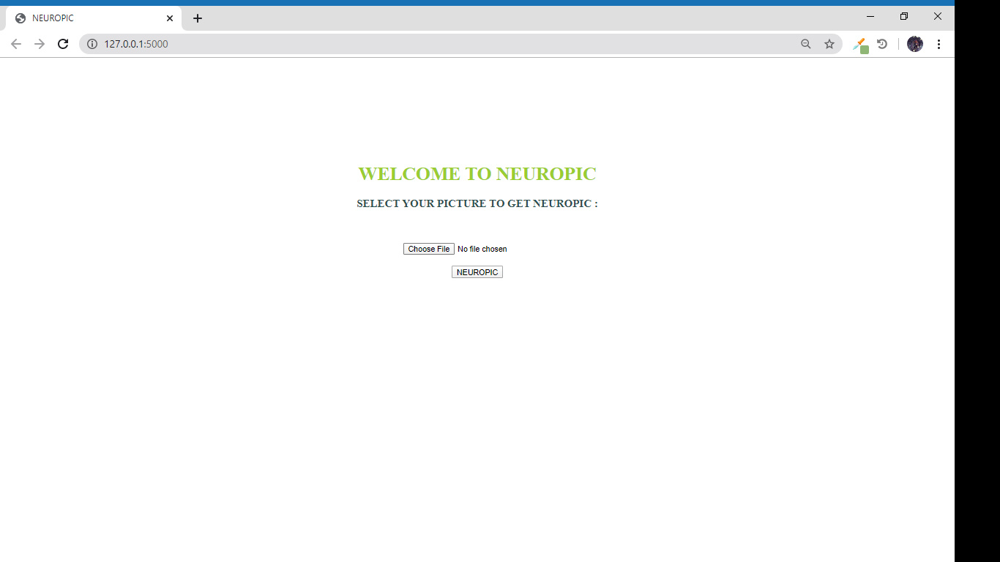
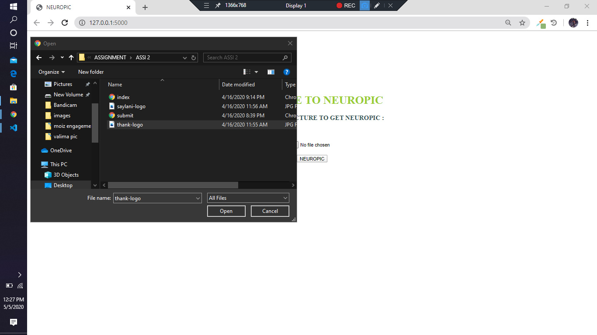
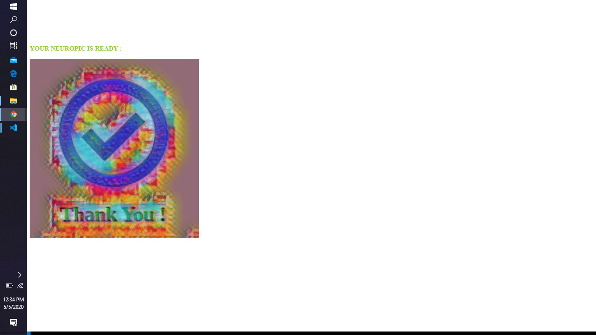

# NEUROPIC

NEUROPIC is the filtered image by using NEURAL STYLE TRANSFER optimization technique. The WEB APP is written in the PYTHON using the FLASK 
WEB FRAMEWORK.

# WEB APP 

## STEP#1
Open the web...

## STEP#2
Select the pic for filter...

## STEP#3
Here is your pic..

